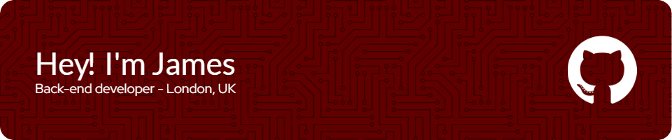

I've been working at <a href="https://www.nationalarchives.gov.uk" target="blank">The National Archives</a> for 4 years as an apprentice back-end developer, mainly using Python frameworks such as Flask, Django, and Wagtail. My main project at TNA has been <a href="https://beta.nationalarchives.gov.uk/">ETNA</a> - a re-work of our current site (<a href="https://github.com/nationalarchives/ds-wagtail">See the code here!</a>) This project has allowed me to hone Python/Wagtail skills, and practice some of my front-end skills where needed.

I have an "accessibility-first" approach to development, striving to ensure our products are accessible to as many people as possible - regardless of their access needs.

I have used many different technologies and been involved in all stages of the SDLC. I thoroughly enjoy learning new things, exploring new pathways and expanding my knowledge in the digital space. This has enabled me to pick up a strong knowledge of Python (Wagtail and Flask), Git, SQL, front-end technologies (HTML, CSS/SASS, JS), and have worked on/managed sites on hosting platforms such as Platform.sh, Dreamhost and AWS.

<h3 align="center">Connect with me!</h3>

