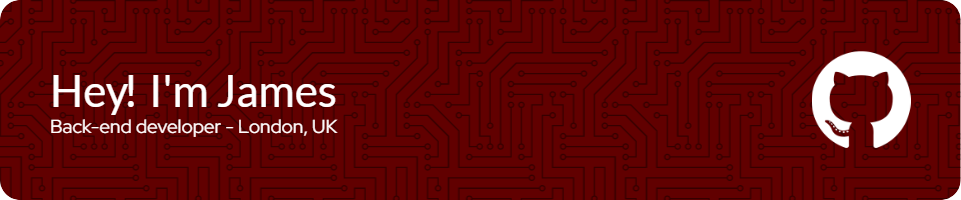

I've been working at <a href="https://www.nationalarchives.gov.uk" target="blank">The National Archives</a> for 6 years as a back-end developer, mainly using Python frameworks such as Flask , Django , and Wagtail 

<h3 align="center">Connect with me!</h3>

